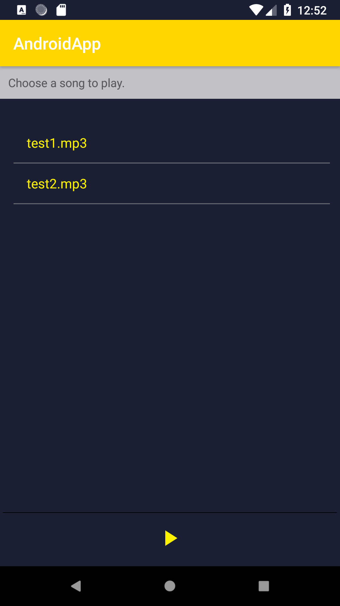

# MiddlewareIce

This is the streaming application for middleware subject.  
---

## Description
I created an Android application which can display musics available on several servers.  
For the purpose of the tests, I only created 2 servers with 1 music (low upload rate) on each servers.

You can select any musics displayed and it will be played in streaming.

## Objectives
- [x] Implement streaming on the app
- [x] Create an Android client application (java)
- [x] Implement a message service (IceStorm)

## Libs & techno used
I used python vlc lib for the streaming service since I started to develop the server in python.  
IceBox and IceStorm to create a pub/sub service with a metaServer and subservers which contains musics.  
Java and Ice for the Android client so that it can communicate with the metaServer.  
All Ice version are 3.7  

Google exo player for android.

## Running the app
Go to Server/IceStormPythonService/META  
Launch IceBox and the metaServer:  
> icebox --Ice.Config=config.icebox  
> python metaServer.py   

Go to Server/IceStormPythonService/SubServers 
Launch the subservers:  
> python server1.py & python server2.py  

Launch or open with android studio the 'AndroidIce' project, build and run. 

Click on any music and listen!

## Troubleshooting
If the app is not working please verify the subservers status.
If they are not working as intended:  
> Delete all the files in Server/IceStormPythonServer/db folder and restart everything  

If the app displays a white screen:
> Server AND/OR IceBox is not running and the app cannot connect to the service

## Repos
Both server and client are available through git repos:
- Server : https://github.com/fLaVz/IceStormPythonService  
- Client : https://github.com/fLaVz/AndroidIceClient